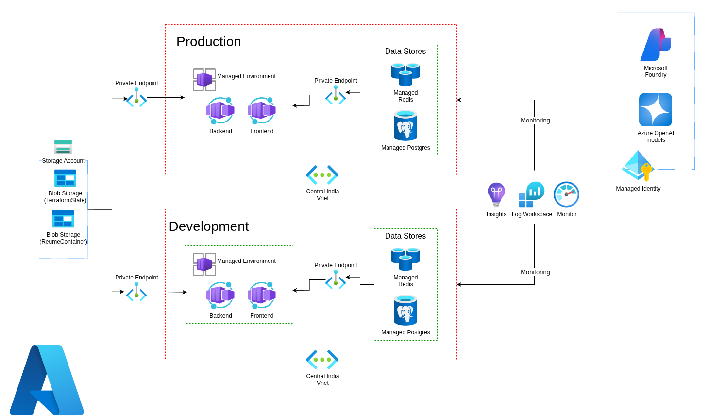

# Case Study: CareerSynth — AI-Powered Career Acceleration Platform

## 1. The Challenge

**The project:** CareerSynth is a solo-built, production AI platform designed to help job seekers — students, developers, and professionals — cut through the most time-consuming parts of the job application process: writing resumes, crafting cover letters, and preparing for interviews.

**The problem:** The modern job application process is broken in a specific, quantifiable way. Tailoring a resume to a job description, writing a non-generic cover letter, and preparing meaningfully for interviews are each hours of work — and most job seekers are doing all three simultaneously across multiple applications. Generic resumes don't pass ATS filters. Generic cover letters don't get read. Interview prep without structure doesn't stick.

The challenge was to build a platform that felt genuinely useful rather than just another AI wrapper — one that could:

- Generate **ATS-optimized resumes** tailored to specific roles and industries, not boilerplate output.
- Produce **personalized cover letters** grounded in the user's actual resume and the specific job description, not a template with swapped names.
- Deliver **structured interview preparation** that adapts to the role the user is applying for.
- Do all of this at scale, reliably, for real users — not just as a demo.

Building it solo meant every architectural decision had to justify its complexity. The platform needed to be production-grade from day one, not something to "clean up later."

## 2. The Solution

**The solution:** I designed and built CareerSynth end-to-end as a solo project — product, architecture, AI workflows, infrastructure, and CI/CD — deployed live at [careersynth.app](https://careersynth.app).

The platform runs on Azure Container Apps with a Next.js frontend and a Python FastAPI backend deployed as separate containers, powered by a single AI agent built on Microsoft Agent Framework with Azure OpenAI (GPT-4 / GPT-4o) handling all core career workflows. An Azure DevOps pipeline manages the full build and deployment lifecycle.

The architecture was shaped by three priorities:

1. **Agent-driven workflows over rigid chains** — rather than hardcoding prompt sequences, a single Microsoft Agent Framework agent with structured tool use handles resume generation, cover letter creation, and interview preparation, adapting its behaviour to the task and user context rather than following fixed templates.
2. **Containerised separation of concerns** — frontend and backend run as independent containers on Azure Container Apps, scaling separately and deployable independently, keeping the architecture clean as the platform grows.
3. **Fully automated delivery** — an Azure DevOps pipeline builds, tests, and deploys both containers on every change, so there's no manual deployment step between a code change and production.

### Solution Architecture

*Users interact with the Next.js frontend on Azure Container Apps. Requests hit the Python FastAPI backend, where the Microsoft Agent Framework agent orchestrates Azure OpenAI (GPT-4 / GPT-4o) to execute resume, cover letter, and interview prep workflows. Azure DevOps manages CI/CD across both containers.*

## 3. Technologies Used

* **Frontend:** Next.js (Azure Container Apps)
* **Backend:** Python, FastAPI (Azure Container Apps)
* **AI Agent:** Microsoft Agent Framework
* **AI Models:** Azure OpenAI — GPT-4 / GPT-4o
* **Infrastructure:** Azure Container Apps
* **CI/CD:** Azure DevOps pipeline
* **Core workflows:** ATS resume generation, cover letter personalisation, interview preparation

## 4. Implementation Highlights

### 4.1. Single Agent with Structured Tool Use
Rather than building three separate pipeline chains for resume, cover letter, and interview prep — which would have meant three codebases to maintain and three prompt strategies to keep consistent — I built a single Microsoft Agent Framework agent with structured tool use that handles all three workflows. The agent interprets the user's request and context, selects the appropriate tool, and drives the Azure OpenAI call with the right grounding — user resume data, job description, target role — rather than sending raw prompts. This keeps the AI layer maintainable and makes it straightforward to extend with new workflows without restructuring the core architecture.

### 4.2. ATS-Optimised Resume Generation
Resume generation was the hardest workflow to get right. The agent grounds every resume output in both the user's actual experience and the specific job description, structuring content to pass ATS keyword filtering without producing keyword-stuffed output that reads poorly to a human reviewer. The FastAPI backend handles the parsing and structuring of user input before it reaches the agent, so the model works with clean, structured context rather than freeform text.

### 4.3. Personalised Cover Letter and Interview Prep Workflows
Cover letter generation is grounded in the same dual context — user resume plus job description — so outputs reference the user's actual background against the role's specific requirements rather than producing generic introductions. Interview preparation generates role-appropriate questions (technical and behavioural) with structured guidance, adapting to the target role and seniority rather than serving a fixed question bank.

### 4.4. Containerised Deployment on Azure Container Apps
The Next.js frontend and FastAPI backend run as independent containers on Azure Container Apps, which was the right call over AKS for a solo-built platform at this stage — managed scaling, no cluster overhead, and straightforward container deployment without the operational tax of running a full Kubernetes control plane. Each container scales independently based on demand, and the separation means frontend changes can be deployed without touching the backend and vice versa.

### 4.5. Azure DevOps CI/CD Pipeline
An Azure DevOps pipeline handles the full delivery lifecycle — building both containers, running tests, and deploying to Azure Container Apps on every push. This meant from the first production deployment, there was no manual step between a code change and it being live. For a solo project with real users, having a reliable, automated deployment path wasn't optional — it was the only way to ship confidently without a team around to catch mistakes.

## 5. Business Outcomes

> *CareerSynth is a live, production platform at careersynth.app with real users. Outcome metrics reflect the platform's designed capabilities and early production behaviour rather than a formal A/B comparison.*

* **Live in production:** CareerSynth is deployed and serving real users at [careersynth.app](https://careersynth.app) — a solo-built, production-grade AI platform from architecture through to deployment, end-to-end.
* **Full workflow coverage:** Resume generation, cover letter personalisation, and interview preparation delivered through a single agent, covering the three highest-effort parts of a job application in one platform.
* **Automated delivery from day one:** Azure DevOps CI/CD pipeline means every change ships through an automated, tested deployment — no manual production steps, no "works on my machine" releases.
* **Scalable without cluster overhead:** Azure Container Apps provides independent scaling for frontend and backend without the operational cost of managing an AKS cluster — the right trade-off for a solo-maintained, production platform.
* **Extensible AI layer:** The single-agent architecture with structured tool use means new career workflows (job matching, LinkedIn optimisation, resume scoring) can be added as tools without restructuring the core platform.

---

*CareerSynth is an independent solo project — designed, built, and operated by Aditya Nile. Live at [careersynth.app](https://careersynth.app).*
